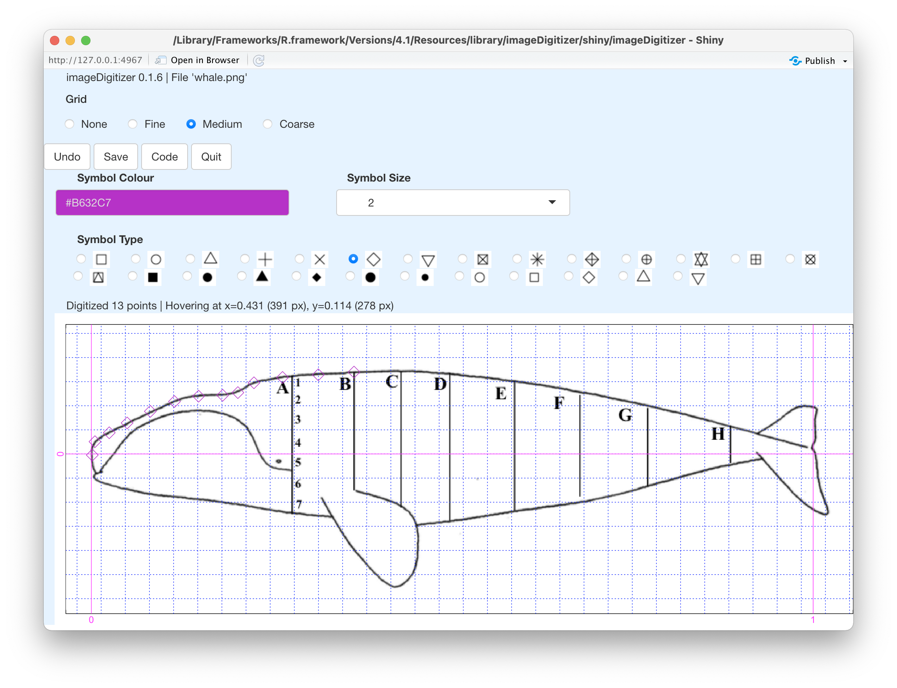

<!-- HOW TO BUILD THE VIGNETTE. -->
<!-- 1. edit this file in vignettes/imageDigitizer.Rmd -->
<!-- 2. run devtools::build_vignettes() -->
<!-- 3. build imageDigitizer -->


```{r, echo = FALSE}
knitr::opts_chunk$set(collapse = TRUE, comment = "#>")
```

A sample screenshot is shown below. The purpose is to trace the outline of a
schematic side-view of a Right Whale (*Eubalaena glacialis*), taken from Daoust
*et al.* (2018).  Since this diagram is drawn natural scale, just a single
value was used to specify the $y$ coordinate).  At this stage, 14 points have
been digitized, and the mouse is hovering over $x=0.238$ and $y=0.413$.

Magenta lines and labels indicate the specified coordinate system, and dotted
blue lines are a grid that (sometimes) can be useful in guiding the eye.

Any point clicked in error can be eliminated by clicking the **Undo** button,
which removes the most recently added point. (Actually, **Undo** will remove
all the points, if the user clicks enough, but it a good idea to keep a close
eye on the digitized points, so that only single-point corrections will be
required.)

Clicking the **Save** button saves the results to a file, and clicking the
**Code** button shows how to read that file and plot the digitized points.
(Note that clicking the **Quit** button saves the file first.)

Various GUI elements permit controlling the look of the digitized points. These
can be helpful in digitizing graphs that have points on them.  It is also worth
nothing that open symbols can be a good choice, since they make it easier to
check that the point was clicked appropriately.



**References**

Daoust, Pierre-Yves, Émilie L. Couture, Tonya Wimmer, and Laura Bourque.
“Incident Report. North Atlantic Right Whale Mortality Event in the Gulf of St.
Lawrence, 2017.” Canadian Wildlife Health Cooperative, Marine Animal Response
Society, and Fisheries and Oceans Canada, 2018.
http://publications.gc.ca/site/eng/9.850838/publication.html.

