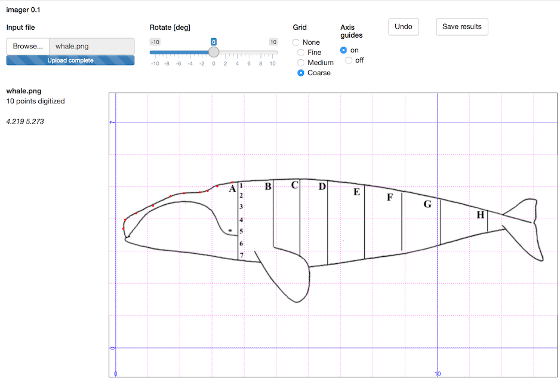

<!-- HOW TO BUILD THE VIGNETTE. -->
<!-- 1. edit this file in vignettes/imager.Rmd -->
<!-- 2. run devtools::build_vignettes() -->
<!-- 3. build imager -->


```{r, echo = FALSE}
knitr::opts_chunk$set(collapse = TRUE, comment = "#>")
```

A sample screenshot is shown below. The purpose is to trace the outline of a
schematic side-view of a Right Whale (*Eubalaena glacialis*), taken from Daoust
*et al.* (2018).

There is no axis in this case, so at the stage of viewing, a scale had been set
by clicking on four points on the background grid. A coarse grid setting is
used, to make it easier to count. It makes sense to define axes over a broad
expanse of the plot, so that mouse-click errors are made smaller, relative to
the domain size.  The axes can be seen with the blue guiding lines.

At the stage of the snapshot, 10 data points have been clicked, and are visible
as red dots. Any point clicked in error can be eliminated by clicking the Undo
button, which removes the most recently added point. (Actually, Undo will
remove all the points, if the user clicks enough, but it a good idea to keep a
close eye on the digitized points, so that only single-point corrections will
be required.)




**References**

Daoust, Pierre-Yves, Émilie L. Couture, Tonya Wimmer, and Laura Bourque.
“Incident Report. North Atlantic Right Whale Mortality Event in the Gulf of St.
Lawrence, 2017.” Canadian Wildlife Health Cooperative, Marine Animal Response
Socieity, and Fisheries and Oceans Canada, 2018.
http://publications.gc.ca/site/eng/9.850838/publication.html.

